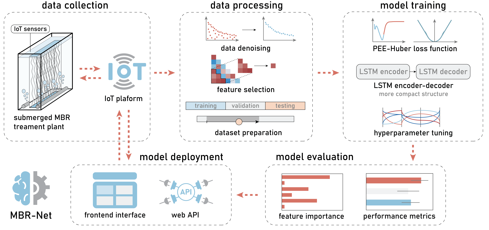

# [MBR-Net](https://github.com/Jassssz/MBR-Net)


This GitHub repository contains codes of the machine learning model `MBR-Net` for predicting membrane fouling of membrane bioreactor (MBR) wastewater treatment plants (WWTPs). The ML model was trained using an extensive data set obtained from full-scale wastewater treatment plants.

## Installation
### Dependencies
#### Windows Subsystem for Linux
This repository was tested on Windows Subsystem for Linux by using Anaconda.
```
conda create -n MBRNet python=3.10.14
conda activate MBRNet
conda install -c conda-forge cudatoolkit=11.2 cudnn=8.1.0
```
configure the system paths
```
mkdir -p $CONDA_PREFIX/etc/conda/activate.d

echo 'export LD_LIBRARY_PATH=$LD_LIBRARY_PATH:$CONDA_PREFIX/lib/' > $CONDA_PREFIX/etc/conda/activate.d/lib.sh
```

Install required python packages using `requirements.txt` file in [scripts](./scripts/) folder
```
pip install -r requirements.txt
```

#### Windows
The repository could also be run for tensorflow (<2.11) on Windows system.
```
conda create -n MBRNet python=3.10.14
conda activate MBRNet
conda install -c conda-forge cudatoolkit=11.2 cudnn=8.1.0
python -m pip install 'tensorflow<2.11'
```

## Data sets

An example of data set after data processing is provided in the [dataset](./dataset/) folder. 

Note: Raw data were generated at Beijing Origin Water’s wastewater treatment facilities. The data supporting the model development are not publicly available due to them containing information of MBR water treatment plants that could compromise research participant consent. Derived data supporting the results of model evaluation are available in the [results_source_data](./results_source_data/) folder.  
Codes related to data processing, model deployment and front-end web interface will also remain unavailable to the public due to the confidential information of MBR water treatment plants contained in these codes; however, the relevant pseudocodes have been provided in Supplementary Notes.

## Getting Started
The best-performing model with learned parameters (`R168_Dropout.1_bs1024_lr0.005_Delta5_CLFHuber5_Adam.h5`) can be downloaded from the [models](./models/) folder. All other models used in performance evaluation can be found in the [model_repetitions](./models/model_repetitions/) and [model_ablation](./models/model_ablation/) folders.

### A. Performance evaluation on the testing set:
1. open `test.ipynb` in the [model](./models/) folder.
2. configure the model file location and the loss function in the following jupyter notebook cell (configure the cell with the function `def pred_model('index')` to evaluate the performance of models with regard to choice of loss function).
```python
file_name = '../models/R168_Dropout.1_bs1024_lr0.005_Delta5_CLFHuber5_Adam'
filepath=os.path.join(file_name + '.h5')

regressor=load_model(filepath,
                     custom_objects={'custom_loss_function': custom_loss_function})
```
3. check `result_df` for the performance results.


### B. Model training:
1. configure the hyperparameter settings and model structure using `model.py` in the [model](./models/) folder for training the model using either MSE or Huber function, or using `train.ipynb` for training the model using PEE-Huber loss function.
2. open `train.ipynb`, execute the following cells to load the dataset and performance metrics:
```python
from dataset import load_dataset, shuffle_apply_scaler, perm_distribution

df, perm_df, param_df, time_df = load_dataset('../dataset/dataset_example.xlsx')

means, Distribution = perm_distribution(df)
X1_arr_train_shuffle, X2_arr_train_shuffle, Y_arr_train_shuffle, X1_arr_valid_shuffle, X2_arr_valid_shuffle, Y_arr_valid_shuffle, X1_arr_test_shuffle, X2_arr_test_shuffle, Y_arr_test_shuffle, timestamp_test = shuffle_apply_scaler(df, perm_df, param_df, time_df)
```
```python
import matplotlib.pyplot as plt

metric_dic = {
    'CLF': 'loss',
    'RMSE': 'root_mean_squared_error',
    'MAPE': 'mean_absolute_percentage_error',
    'MSE': 'root_mean_squared_error',
    'MAE': 'mean_absolute_error'}

def loss_metric_plot(history, save_location, metric_name_str):
    ...
    return plt.show
```
3. configure the location to save the models and start model training.
```python
# can be either clf_model, MSE_model, or huber_model
history = clf_model(0, 
                    X1_arr_train_shuffle, 
                    X2_arr_train_shuffle, 
                    Y_arr_train_shuffle, 
                    X1_arr_valid_shuffle, 
                    X2_arr_valid_shuffle,
                    Y_arr_valid_shuffle) 

folder_name = './model/'
file_name = 'R168_Dropout.1_bs1024_lr0.005_Delta5_CLFHuber5_Adam' + str(0)
loss_metric_plot(history, folder_name + 'graph/' + file_name, 'CLF')
loss_metric_plot(history, folder_name + 'graph/' + file_name, 'MAPE')
loss_metric_plot(history, folder_name + 'graph/' + file_name, 'RMSE')
loss_metric_plot(history, folder_name + 'graph/' + file_name, 'MAE')

```

## Real-time prediction
API gateways and a front-end web interface were developed for MBR-Net to facilitate the generation of ML model predictions based on actual WWTP data in real time [(demonstration video)](https://www.dropbox.com/scl/fi/476fbk2fo8flaa12f5q03/MBR-Net_supplementary_video_1.mp4?rlkey=2446e2yo3lak66i6d8kuv1g32&st=e8y0yojw&dl=0).

## License
This project is licensed under [![CC BY-NC 4.0][cc-by-nc-shield]][cc-by-nc]. See the `LICENSE` file for more information. 
[Creative Commons Attribution-NonCommercial 4.0 International License][cc-by-nc].

[![CC BY-NC 4.0][cc-by-nc-image]][cc-by-nc]

[cc-by-nc]: https://creativecommons.org/licenses/by-nc/4.0/
[cc-by-nc-image]: https://licensebuttons.net/l/by-nc/4.0/88x31.png
[cc-by-nc-shield]: https://img.shields.io/badge/License-CC%20BY--NC%204.0-lightgrey.svg
